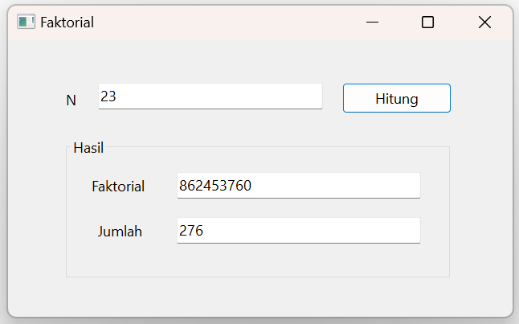
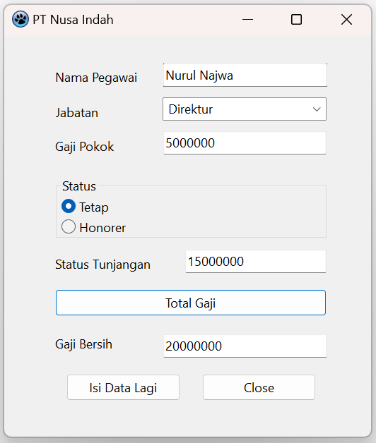
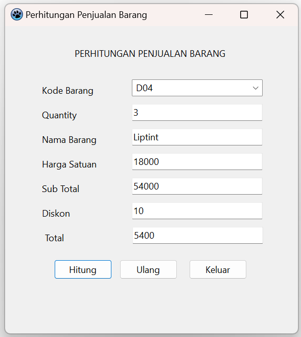

# Tugas1: Perulangan

```bash
Nama    : Nurul Najwa Sabilla
Kelas   : TI.21.A.3
Nim     : 312110451
```

## Output

1. Program untuk menentukan faktorial



2. Program menghitung gaji karyawan



3. Program Penjualan Barang

